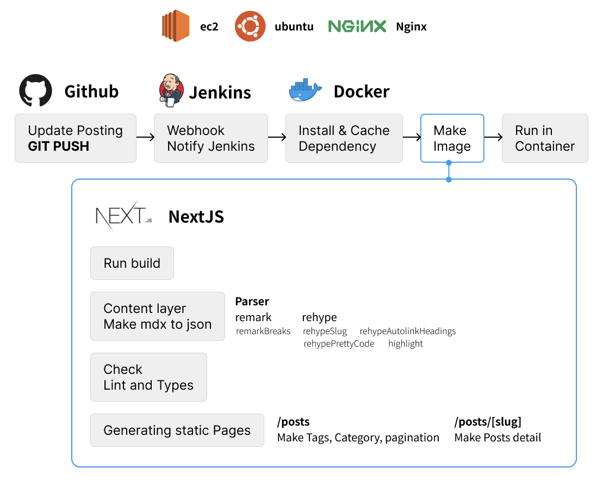

# 개인 블로그 Readme

## 프로젝트 소개

환영합니다. 개인 개발 블로그입니다.
<br/>
https://heisje.site/
에서 확인해보실 수 있습니다.

## 기술 스택

- Next.js
- TypeScript
- Contentlayer
- tailwind
- Docker
- Jenkins
- EC2/ubuntu/Nginx

## 아키텍처



## 환경 설정

1. pnpm 패키지 설치

```
pnpm install
```

2. 개발서버 시작

```
next dev
```

3. http://localhost:3000/
   에서 확인합니다.

## 라우터

메인 : https://heisje.site/
<br>블로그 : https://heisje.site/blog
<br>소개 : https://heisje.site/about

## 구현 목록

### BLOG Core

- [x] Mdx to MdxComponent
- [ ] Mdx Components
  - [ ] Image
  - [ ] Youtube
  - [ ] codepen
- [x] SSG
- [x] Read Count
- [x] Category
- [x] Tag
- [ ] SEO (Tag / Category...)

### BLOG Main

- [x] Search
- [x] Pagination
- [x] Category
- [x] Tag

### BLOG Detail

- [x] 댓글
- [ ] 목차
- [ ] 이전글 이후글

### Home

- [x] header
- [x] nav
- [x] footer
- [x] body
- [x] dark / white mode

### 기타

- [x] Post 정렬
- [x] 다크모드 새로고침
- [ ] 사용자기반 다크모드

# 컬러 구현 내용
테일윈드 단일로 반응형 컬러구현이 번거로워 post-css를 같이 활용해 반응형으로 컬러가 구현됨. 테일윈드는 고정적인 컬러를 활용할 때 사용됨.

현재 세부적인 반응형 컬러를 위해 `text-heading` `text-body` 두가지 컬러만 사용하고 나머지는 전역으로 처리

